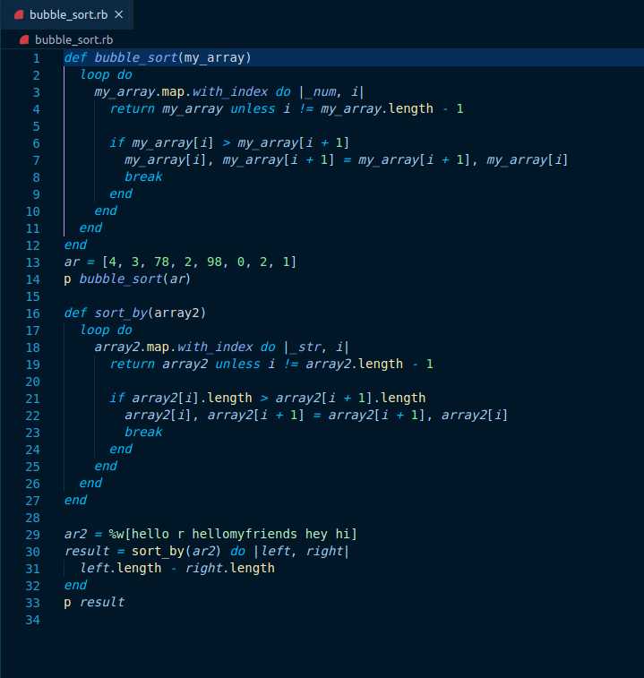

# Bubble-Sort

> Bubble Sort algorithm is developed in ruby. (Luis and Alex)

Additional description about the project and its features.

Built With
Ruby

## Built With

- Ruby
- Rubocop

## Live Demo

[Hosted on repl.it](https://repl.it/@pipe2442/bubbleSort#main.rb)

## Getting Started

To get a local copy  and to set it up and running follow these simple example steps.

### Prerequisites

- Text Editor (VSCode is suggested.)
- Ruby

### Setup
- Install git
- Open Terminal
- Change directory to folder to download repository
- Use cd <file-path>
- Run git clone https://github.com/Alexoid1/Bubble-Sort
- Install Ruby
- Run ruby main.rb

## Authors

👤 **Pablo Alexis Zambrano Coral**

- Github: [@Alexoid1](https://github.com/Alexoid1)
- Twitter: [@pablo_acz](https://twitter.com/pablo_acz)
- Linkedin: [linkedin](https://www.linkedin.com/in/pablo-alexis-zambrano-coral-7a614a189/)

 👤 **Luis Felipe Angulo Torres**
 
- Github: [@pipe2442](https://github.com/pipe2442)
- Twitter: [@pipe2442](https://twitter.com/pipe2442)
- Linkedin: [linkedin](https://www.linkedin.com/in/luis-felipe-angulo-torres-95098b139/)

## Show your support

Give a ⭐️ if you like this project!

## Acknowledgments

- Inspiration
- Algorith solving
- etc

## 📝 License

This project has no license
